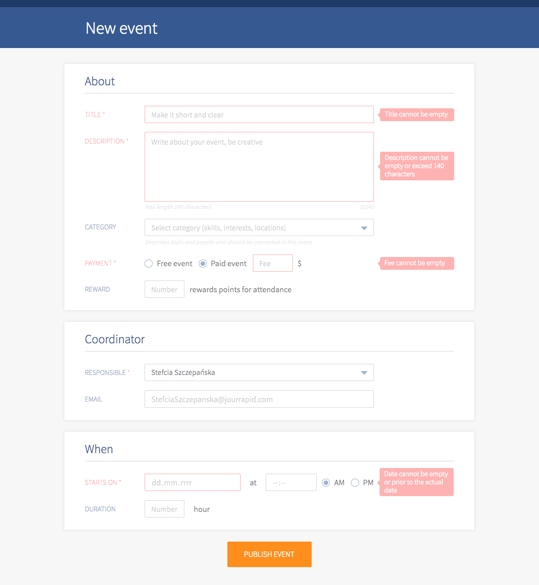

# Event Form

This is a form on an imaginary social networking platform. Its users can create events, assing them to one of given categories and reward attendants with points they can collect.


## Getting Started

To run this project you will need to have **Node.js** installed on your local machine. After forking and cloning the repo please run these commands in your command line:

```
npm i
```

and

```
npm start
```

The project will be running in your browser at http://localhost:8080/.


## Tools

- React
- Sass
- Webpack


## Demo

### **[Event form](https://karin-on.github.io/event-form/)**


## Features and validation

- Fields `title`, `description`, `coordinator`, `date` and `time` are mandatory.
- The description can’t be longer than 140. Below the field there is a character counter.
- The event is either free or paid. A fee `field` appears only if a **paid** option is checked.
- Each event has to have a person in charge. By default the selected option is a user currently logged in (ID of a person logged in is hard coded).
- The `email` field is mandatory but it’s read-only. Email addresses are assigned to coordinators and are loaded from a data base (separate file in my project).
- It’s impossible to create an event prior to the actual date and the starting time must be provided in 12 hour format. On the output date and time are formatted as `YYYY-MM-DDTHH:mm` (time in 24 hour format).
- Fields `fee`, `reward` and `duration` accept only digits.
- After submiting data and successful validation the form closes and **Success** information appears. All the data from the form is displayed in a console as an object:

```js
{
  title: string,
  description: string,
  category_id: number,
  paid_event: boolean,
  event_fee: number,
  reward: number,
  date: string, // YYYY-MM-DDTHH:mm (example: 2018-01-19T15:15)
  duration: number, // in seconds
  coordinator: {
    email: string,
    id: string,
  },
}
```

- The form has custom drop-down lists instead of default HTML select elements (work in progress).


## Previews





